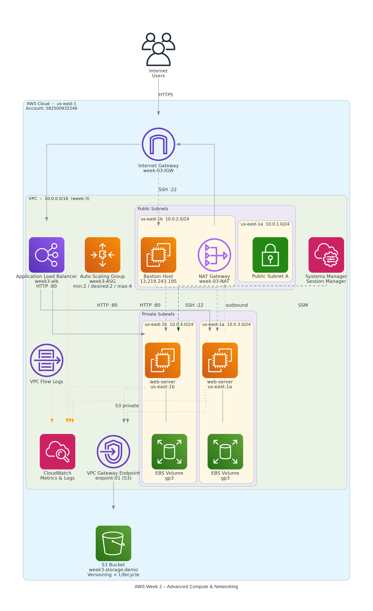

# AWS Cloud Training — Week 2 Extension
## Advanced Compute & Networking

> **Account:** 582500932246 &nbsp;|&nbsp; **Region:** us-east-1 (N. Virginia) &nbsp;|&nbsp; **Period:** June 21 – 23, 2026

---

## Learning Objectives

| # | Objective |
|---|-----------|
| 1 | Design a highly available VPC across multiple Availability Zones |
| 2 | Deploy scalable web applications using Load Balancers and Auto Scaling |
| 3 | Implement secure access patterns for private resources |
| 4 | Explore advanced S3 and EBS capabilities |
| 5 | Monitor and troubleshoot AWS networking and compute resources |
| 6 | Document and diagram production-style architectures |

---

## Table of Contents

- [Day 1 – Multi-AZ VPC Design](#day-1--multi-az-vpc-design)
- [Day 2 – Automated EC2 Provisioning](#day-2--automated-ec2-provisioning)
- [Day 3 – Load Balancing and Auto Scaling](#day-3--load-balancing-and-auto-scaling)
- [Day 4 – Private Connectivity](#day-4--private-connectivity)
- [Day 5 – Advanced Storage](#day-5--advanced-storage)
- [Day 6 – Monitoring and Private AWS Access](#day-6--monitoring-and-private-aws-access)
- [Day 7 – Architecture Documentation](#day-7--architecture-documentation)

---

## Day 1 – Multi-AZ VPC Design

### Concepts Studied
- CIDR notation and subnetting
- Availability Zones and fault tolerance
- Route Tables for traffic direction
- Internet Gateway for public subnet access
- NAT Gateway for private subnet outbound traffic
- Security Groups vs Network ACLs

### Tasks Implemented

- [ ] Create a VPC with CIDR block `10.0.0.0/16`
- [ ] Create two public subnets in different AZs
- [ ] Create two private subnets in different AZs
- [ ] Attach an Internet Gateway to the VPC
- [ ] Create a NAT Gateway in one public subnet
- [ ] Configure route tables for public and private subnets
- [ ] Launch a test EC2 instance in a private subnet and verify outbound internet access

### Key Resources Created

| Resource | Name / Detail |
|----------|--------------|
| VPC | `week-3` — `10.0.0.0/16` |
| Public Subnet A | `us-east-1a` — `10.0.1.0/24` |
| Public Subnet B | `us-east-1b` — `10.0.2.0/24` |
| Private Subnet A | `us-east-1a` — `10.0.3.0/24` |
| Private Subnet B | `us-east-1b` — `10.0.4.0/24` |
| Internet Gateway | `week-03-IGW` |
| NAT Gateway | `week-03-NAT` |

---

## Day 2 – Automated EC2 Provisioning

### Concepts Studied
- EC2 User Data for boot-time automation
- Instance Metadata Service (IMDS)
- IAM Roles for EC2 instances
- Security Group best practices (least privilege)

### Tasks Implemented

- [ ] Create an IAM role for EC2 with read-only S3 access
- [ ] Launch two EC2 instances using User Data scripts
- [ ] Install and configure Nginx or Apache via User Data
- [ ] Restrict SSH access to your public IP only
- [ ] Verify web server is accessible from a browser

### Key Resources Created

| Resource | Detail |
|----------|--------|
| IAM Role | `EC2-S3-ReadOnly-Role` with `AmazonS3ReadOnlyAccess` |
| EC2 Instances | Two instances with web servers auto-configured at launch |
| Security Group | SSH restricted to specific public IP |

---

## Day 3 – Load Balancing and Auto Scaling

### Concepts Studied
- Application Load Balancer (ALB)
- Target Groups and health checks
- Launch Templates
- Auto Scaling Groups (ASG)

### Tasks Implemented

- [ ] Create an Application Load Balancer
- [ ] Create a Target Group and register EC2 instances
- [ ] Configure health checks on the Target Group
- [ ] Create a Launch Template
- [ ] Create an Auto Scaling Group spanning two AZs
- [ ] Set minimum, desired, and maximum capacities (`min:2 / desired:2 / max:4`)
- [ ] Verify self-healing by terminating an instance and confirming replacement

### Key Resources Created

| Resource | Name / Detail |
|----------|--------------|
| Load Balancer | `week3-alb` — HTTP:80 |
| Auto Scaling Group | `week3-ASG` — min:2, desired:2, max:4 |
| Availability Zones | `us-east-1a` and `us-east-1b` |

---

## Day 4 – Private Connectivity

### Concepts Studied
- Bastion Host pattern
- AWS Systems Manager Session Manager
- SSH Agent Forwarding

### Tasks Implemented

- [ ] Deploy a Bastion Host in a public subnet
- [ ] Launch an EC2 instance in a private subnet
- [ ] Configure Security Groups — allow SSH only through Bastion Host
- [ ] Connect to the private instance via Bastion Host (SSH jump)
- [ ] Repeat access using Session Manager (no port 22 required)

### Key Resources Created

| Resource | Detail |
|----------|--------|
| Bastion Host | Public subnet — `13.219.243.195` |
| Private Instance | Private subnet — accessible only via Bastion or SSM |
| Security Groups | `Bastion-SG` → `Private-SG` chain; no direct public access |
| SSM Session Manager | Agentless access to private instance without port 22 |

---

## Day 5 – Advanced Storage

### Concepts Studied
- EBS volume types (`gp2`, `gp3`, `io1`) and use cases
- EBS Snapshots for backup and restoration
- S3 Versioning for object history
- S3 Lifecycle Policies for automated transitions
- S3 Storage Classes: Standard, Standard-IA, Glacier

### Tasks Implemented

- [ ] Create and attach an additional EBS volume to an EC2 instance
- [ ] Format, mount, and persist the volume via `/etc/fstab`
- [ ] Create an EBS snapshot and restore a new volume from it
- [ ] Enable versioning on S3 bucket `week3-storage-demo`
- [ ] Upload multiple versions of a file and restore a previous version
- [ ] Configure a lifecycle rule to transition objects to a lower-cost storage class

### Key Resources Created

| Resource | Detail |
|----------|--------|
| EBS Volume | `gp3` type — attached, formatted, mounted |
| EBS Snapshot | Created from the additional volume |
| S3 Bucket | `week3-storage-demo` — versioning enabled |
| Lifecycle Rule | `MoveToIA` — transitions objects to Standard-IA |

---

## Day 6 – Monitoring and Private AWS Access

### Concepts Studied
- VPC Endpoints (Gateway type for S3 and DynamoDB)
- CloudWatch Metrics, Logs, and Alarms
- VPC Flow Logs for network traffic analysis
- CloudWatch Agent for custom metrics

### Tasks Implemented

- [ ] Create a Gateway VPC Endpoint for S3
- [ ] Access S3 from a private EC2 instance without a NAT Gateway
- [ ] Enable VPC Flow Logs on the VPC
- [ ] Generate network traffic and analyze captured logs
- [ ] Install and configure the CloudWatch Agent
- [ ] Monitor CPU, memory, and disk utilization via CloudWatch

### Key Resources Created

| Resource | Detail |
|----------|--------|
| VPC Endpoint | `enpoint-01` — Gateway type for `com.amazonaws.us-east-1.s3` |
| VPC Flow Logs | Enabled on `week-3` VPC, delivered to CloudWatch Logs |
| CloudWatch Agent | Monitoring CPU, memory, and disk on private EC2 instances |

---

## Day 7 – Architecture Documentation

### Concepts Studied
- AWS Well-Architected Framework
- Reliability Pillar
- Security Pillar
- Cost Optimization Pillar

### Tasks Implemented

- [ ] Create an architecture diagram including all components below
- [ ] Add the diagram to the repository
- [ ] Write a walkthrough covering traffic flow, security controls, and scaling behavior
- [ ] Prepare this README documenting all implementations and observations

### Architecture Diagram



*Figure: AWS Week 2 – Advanced Compute & Networking Architecture (us-east-1)*

### Architecture Components

| Component | Resource |
|-----------|----------|
| VPC | `week-3` — `10.0.0.0/16` |
| Internet Gateway | `week-03-IGW` |
| NAT Gateway | `week-03-NAT` (public subnet) |
| Application Load Balancer | `week3-alb` — HTTP:80 |
| Auto Scaling Group | `week3-ASG` — min:2, desired:2, max:4 |
| EC2 Instances | `web-server-us-east-1a`, `web-server-us-east-1b` (private subnets) |
| Bastion Host | `13.219.243.195` (public subnet) |
| EBS Volumes | `gp3` attached to each web server |
| S3 Bucket | `week3-storage-demo` — versioning + lifecycle |
| VPC Gateway Endpoint | `enpoint-01` — private S3 access |
| CloudWatch | Metrics, Logs, and VPC Flow Logs |
| Systems Manager | Session Manager — agentless private access |

### Traffic Flow Walkthrough

```
Internet Users
     │ HTTPS
     ▼
Internet Gateway (week-03-IGW)
     │
     ▼
Application Load Balancer (week3-alb)  ←──── Auto Scaling Group (week3-ASG)
     │ HTTP:80                                  manages web-server instances
     ▼
Private Subnets (us-east-1a / us-east-1b)
  ├── web-server-us-east-1a  (10.0.3.0/24)
  └── web-server-us-east-1b  (10.0.4.0/24)
     │ outbound (S3 via VPC Endpoint)
     ▼
VPC Gateway Endpoint (enpoint-01) ──► S3 Bucket (week3-storage-demo)

Private EC2 Management:
  Option A: Internet → IGW → Bastion Host (SSH:22) → Private Instance (SSH:22)
  Option B: SSM Agent → Systems Manager Session Manager (no port 22)

Monitoring:
  VPC Flow Logs ──► CloudWatch Logs
  CloudWatch Agent ──► CloudWatch Metrics (CPU / Memory / Disk)
```

### Security Controls

| Control | Implementation |
|---------|---------------|
| Network isolation | Web servers in private subnets, no direct internet exposure |
| Ingress restriction | ALB is the only public entry point for HTTP traffic |
| SSH hardening | SSH to Bastion Host only; private instances allow SSH from Bastion-SG only |
| Port-free access | Session Manager provides shell access without opening port 22 |
| IAM least privilege | EC2 instances hold read-only S3 role; no admin credentials on instances |
| Private S3 access | VPC Gateway Endpoint routes S3 traffic privately, bypassing NAT |
| Traffic visibility | VPC Flow Logs capture all accepted and rejected network flows |

### Scaling Behaviour

The Auto Scaling Group (`week3-ASG`) maintains web server availability automatically:

- **Minimum capacity:** 2 instances (one per AZ) ensures baseline availability
- **Desired capacity:** 2 instances under normal load
- **Maximum capacity:** 4 instances allows scale-out under increased demand
- **Self-healing:** When an instance is terminated or fails a health check, ASG launches a replacement in the same or alternate AZ within minutes
- **Multi-AZ spread:** Instances are distributed across `us-east-1a` and `us-east-1b`, tolerating a full AZ failure without service interruption

---

## Well-Architected Alignment

| Pillar | Implementation |
|--------|---------------|
| **Reliability** | Multi-AZ VPC, ALB, Auto Scaling Group with self-healing |
| **Security** | Private subnets, Security Groups, IAM roles, Session Manager, VPC Endpoint |
| **Cost Optimization** | S3 lifecycle policies (Standard → Standard-IA), VPC Endpoint replacing NAT for S3 traffic |

---

## Repository Structure

```
week2-extension/
├── README.md                  ← This file
├── aws_architecture.png       ← Architecture diagram
└── screenshots/
    ├── day1-vpc-resource-map.png
    ├── day1-ec2-instances.png
    ├── day2-user-data-web-server.png
    ├── day3-alb-target-group.png
    ├── day3-asg-activity.png
    ├── day4-bastion-ssh.png
    ├── day4-ssm-session.png
    ├── day5-ebs-volume.png
    ├── day5-s3-versioning.png
    ├── day5-lifecycle-rule.png
    ├── day6-vpc-endpoint.png
    └── day6-cloudwatch-metrics.png
```

---

*AWS Cloud Training Program — Week 2 Extension | Dilip Kumar*
