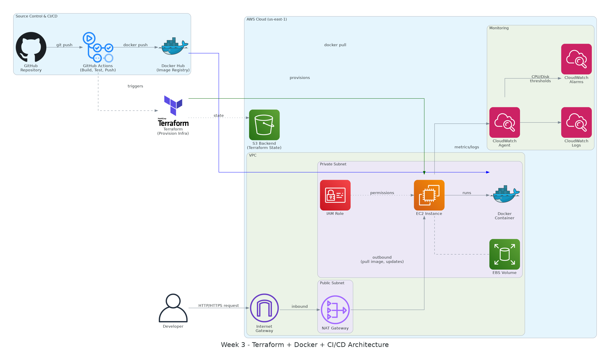

# AWS Cloud Training – Week 3: IaC, CI/CD & Containerized Deployment

[](https://www.terraform.io/)
[](https://www.docker.com/)
[](https://github.com/features/actions)
[](https://aws.amazon.com/)
[](#license)

A production-style, end-to-end deployment pipeline that provisions AWS infrastructure with **Terraform**, containerizes a sample web application with **Docker**, automates build/test/publish with **GitHub Actions**, and deploys automatically to **EC2** with **CloudWatch** monitoring — all inside a custom VPC following AWS Well-Architected Framework practices.

---

## Table of Contents

- [Overview](#overview)
- [Architecture](#architecture)
- [Features](#features)
- [Tech Stack](#tech-stack)
- [Folder Structure](#folder-structure)
- [Prerequisites](#prerequisites)
- [Installation & Setup](#installation--setup)
- [Running the Application](#running-the-application)
- [Terraform Usage](#terraform-usage)
- [CI/CD Pipeline](#cicd-pipeline)
- [API Details](#api-details)
- [Monitoring & Logging](#monitoring--logging)
- [Screenshots](#screenshots)
- [Well-Architected Framework Alignment](#well-architected-framework-alignment)
- [Deployment Guide](#deployment-guide)
- [License](#license)

---

## Overview

This project demonstrates a complete Infrastructure-as-Code and CI/CD workflow on AWS:

1. Application code is pushed to **GitHub**.
2. **GitHub Actions** builds the app, runs tests, builds a Docker image, and pushes it to **Docker Hub**.
3. **Terraform** provisions a secure, Multi-AZ **VPC** with public/private subnets, an EC2 instance, security groups, and an IAM role, storing its state remotely in an **S3 backend**.
4. The EC2 instance bootstraps via **User Data**, installs Docker, and pulls/runs the latest container image automatically.
5. **CloudWatch Agent** ships application logs and system metrics to **CloudWatch Logs**, with **CloudWatch Alarms** monitoring CPU and disk utilization.

---

## Architecture

The diagram below shows the full system flow — from source control through CI/CD, infrastructure provisioning, and runtime monitoring.



### Flow Description

| Stage | Flow |
|---|---|
| **1. Source** | Developer pushes code to the **GitHub Repository**. |
| **2. CI** | **GitHub Actions** triggers on push → builds the app → runs unit tests → builds a Docker image. |
| **3. Registry** | The built image is pushed to **Docker Hub**. |
| **4. Provisioning** | **Terraform** provisions AWS infrastructure (VPC, subnets, EC2, security groups, IAM role) and stores state in an **S3 backend**. |
| **5. Network** | Traffic enters through the **Internet Gateway**, reaches the **public subnet**; the EC2 instance sits in the **private subnet** and reaches the internet outbound via the **NAT Gateway**. |
| **6. Compute** | The **EC2 instance** (with an attached **IAM Role** and **EBS volume**) uses its User Data script to install Docker and pull the latest image from Docker Hub. |
| **7. Runtime** | The application runs inside a **Docker container** on the EC2 instance. |
| **8. Monitoring** | The **CloudWatch Agent** on EC2 streams logs to **CloudWatch Logs** and metrics that trigger **CloudWatch Alarms** (CPU/disk thresholds). |

---

## Features

- ✅ Infrastructure fully defined and versioned as code (Terraform)
- ✅ Modular Terraform design (VPC, EC2, Security Group modules)
- ✅ Remote state management via S3 backend
- ✅ Dev/Prod isolation using Terraform workspaces
- ✅ Multi-AZ VPC with public/private subnet segregation
- ✅ Automated CI/CD pipeline (build → test → containerize → publish → deploy)
- ✅ Zero manual server configuration (bootstrapped via EC2 User Data)
- ✅ Centralized logging and alerting via CloudWatch
- ✅ Least-privilege IAM role attached to EC2 (no hardcoded credentials)
- ✅ Bonus: HTTPS-ready via Nginx reverse proxy, auto-deploy on every push

---

## Tech Stack

| Category | Tools |
|---|---|
| **Infrastructure as Code** | Terraform |
| **Cloud Provider** | AWS (VPC, EC2, S3, IAM, CloudWatch) |
| **Containerization** | Docker |
| **CI/CD** | GitHub Actions |
| **Image Registry** | Docker Hub |
| **Monitoring** | CloudWatch Agent, Logs, Alarms |
| **Reverse Proxy (bonus)** | Nginx |
| **Version Control** | Git / GitHub |

---

## Folder Structure

```
week3-terraform-docker-cicd/
├── .github/
│   └── workflows/
│       └── ci-cd.yml              # GitHub Actions pipeline definition
├── app/
│   ├── src/                       # Sample web application source code
│   ├── tests/                     # Unit tests
│   ├── package.json               # App dependencies (or requirements.txt for Python)
│   └── Dockerfile                 # Container build definition
├── terraform/
│   ├── environments/
│   │   ├── dev/
│   │   │   ├── main.tf
│   │   │   ├── variables.tf
│   │   │   └── terraform.tfvars
│   │   └── prod/
│   │       ├── main.tf
│   │       ├── variables.tf
│   │       └── terraform.tfvars
│   ├── modules/
│   │   ├── vpc/
│   │   │   ├── main.tf
│   │   │   ├── variables.tf
│   │   │   └── outputs.tf
│   │   ├── ec2/
│   │   │   ├── main.tf
│   │   │   ├── variables.tf
│   │   │   ├── outputs.tf
│   │   │   └── user_data.sh       # Docker install + container run bootstrap
│   │   └── security_group/
│   │       ├── main.tf
│   │       ├── variables.tf
│   │       └── outputs.tf
│   ├── backend.tf                 # S3 remote state configuration
│   ├── provider.tf
│   └── outputs.tf
├── docs/
│   ├── architecture-diagram.png
│   └── deployment-guide.md
├── screenshots/
│   ├── terraform-apply.png
│   ├── github-actions-run.png
│   ├── ec2-running-container.png
│   └── cloudwatch-dashboard.png
├── .gitignore
├── .dockerignore
├── LICENSE
└── README.md
```

---

## Prerequisites

Before you begin, ensure you have the following installed and configured:

- [Terraform](https://developer.hashicorp.com/terraform/downloads) `>= 1.5`
- [Docker](https://docs.docker.com/get-docker/) `>= 24.x`
- [AWS CLI](https://docs.aws.amazon.com/cli/latest/userguide/getting-started-install.html) configured with valid credentials (`aws configure`)
- An AWS account with permissions to create VPC, EC2, IAM, S3, and CloudWatch resources
- A [Docker Hub](https://hub.docker.com/) account
- A GitHub account with a repository for this project

---

## Installation & Setup

### 1. Clone the repository

```bash
git clone https://github.com/<your-username>/week3-terraform-docker-cicd.git
cd week3-terraform-docker-cicd
```

### 2. Configure AWS credentials

```bash
aws configure
# AWS Access Key ID, Secret Access Key, Region (e.g., us-east-1), Output format
```

### 3. Configure GitHub Secrets

In your GitHub repository, go to **Settings → Secrets and variables → Actions** and add:

| Secret Name | Description |
|---|---|
| `AWS_ACCESS_KEY_ID` | IAM user access key with deploy permissions |
| `AWS_SECRET_ACCESS_KEY` | Corresponding secret key |
| `DOCKERHUB_USERNAME` | Docker Hub username |
| `DOCKERHUB_TOKEN` | Docker Hub access token |

### 4. Initialize Terraform

```bash
cd terraform/environments/dev
terraform init
```

---

## Running the Application

### Run locally with Docker

```bash
cd app
docker build -t week3-webapp .
docker run -d -p 8080:8080 --name week3-webapp week3-webapp
```

Visit `http://localhost:8080` to verify the app is running.

### Run with persistent volume

```bash
docker run -d -p 8080:8080 -v week3-data:/app/data --name week3-webapp week3-webapp
```

---

## Terraform Usage

```bash
# Select/create a workspace
terraform workspace new dev      # or: terraform workspace select dev

# Preview changes
terraform plan -var-file="terraform.tfvars"

# Apply infrastructure
terraform apply -var-file="terraform.tfvars"

# Retrieve outputs (e.g., EC2 public IP)
terraform output ec2_public_ip

# Tear down infrastructure
terraform destroy -var-file="terraform.tfvars"
```

**Remote state** is stored in an S3 bucket (configured in `backend.tf`), ensuring consistent, shared, and locked state across team members and environments.

---

## CI/CD Pipeline

The GitHub Actions workflow (`.github/workflows/ci-cd.yml`) runs on every push to `main`:

1. **Checkout** repository code
2. **Build** the application
3. **Run unit tests**
4. **Build** the Docker image
5. **Push** the image to Docker Hub
6. *(Bonus)* **Trigger deployment** to EC2 for zero-downtime rollout

```yaml
# Simplified excerpt — full workflow in .github/workflows/ci-cd.yml
on:
  push:
    branches: [ main ]

jobs:
  build-test-publish:
    runs-on: ubuntu-latest
    steps:
      - uses: actions/checkout@v4
      - name: Run tests
        run: npm test
      - name: Build and push Docker image
        run: |
          docker build -t $DOCKERHUB_USERNAME/week3-webapp:${{ github.sha }} .
          docker push $DOCKERHUB_USERNAME/week3-webapp:${{ github.sha }}
```

---

## API Details

The sample web application exposes a minimal REST API used to validate deployment health:

| Method | Endpoint | Description | Response |
|---|---|---|---|
| `GET` | `/` | Root welcome route | `200 OK` — app name & version |
| `GET` | `/health` | Health check used for deployment verification | `200 OK` — `{ "status": "healthy" }` |
| `GET` | `/version` | Returns current deployed build/commit SHA | `200 OK` — `{ "version": "<git-sha>" }` |

> Adjust or expand this table to match your actual application's routes.

---

## Monitoring & Logging

- **CloudWatch Agent** is installed on EC2 via the Terraform User Data script.
- Application and system logs stream to **CloudWatch Logs** under a dedicated log group.
- **CloudWatch Alarms** are configured for:
  - CPU utilization exceeding a defined threshold (e.g., 80%)
  - Disk usage exceeding a defined threshold (e.g., 85%)
- Alarms can be connected to an SNS topic for email/Slack notifications.

---

## Screenshots

> Replace the placeholders below with actual screenshots from your deployment.

### Terraform Apply Output


### GitHub Actions Workflow Run


### Running Application Container on EC2


### CloudWatch Dashboard


---

## Well-Architected Framework Alignment

| Pillar | Implementation |
|---|---|
| **Reliability** | Multi-AZ VPC design, NAT Gateway for resilient outbound connectivity, Terraform state locking to prevent concurrent conflicting changes, immutable container deployments. |
| **Security** | Least-privilege IAM role scoped to EC2, security groups restricting inbound traffic, no hardcoded credentials (GitHub Secrets + IAM roles), private subnet placement for compute resources. |
| **Cost Optimization** | Right-sized EC2 instance types, S3 for low-cost state storage, teardown via `terraform destroy` after use, CloudWatch alarms to catch runaway resource usage early. |

---

## Deployment Guide

A detailed, step-by-step deployment walkthrough is available in [`docs/deployment-guide.md`](./docs/deployment-guide.md), covering:

1. Provisioning infrastructure with Terraform
2. Verifying the S3 backend and state locking
3. Confirming EC2 bootstrap via User Data logs
4. Validating the running container and health endpoint
5. Confirming CloudWatch log ingestion and alarm status
6. (Bonus) Enabling HTTPS via Nginx reverse proxy
7. (Bonus) Verifying zero-downtime deployment on subsequent pushes

---

## License

This project is licensed under the [MIT License](./LICENSE).

---

**Author:** Dilip
**Program:** AWS Cloud Training Program — Week 3 Extension (IaC, CI/CD & Containerization)
